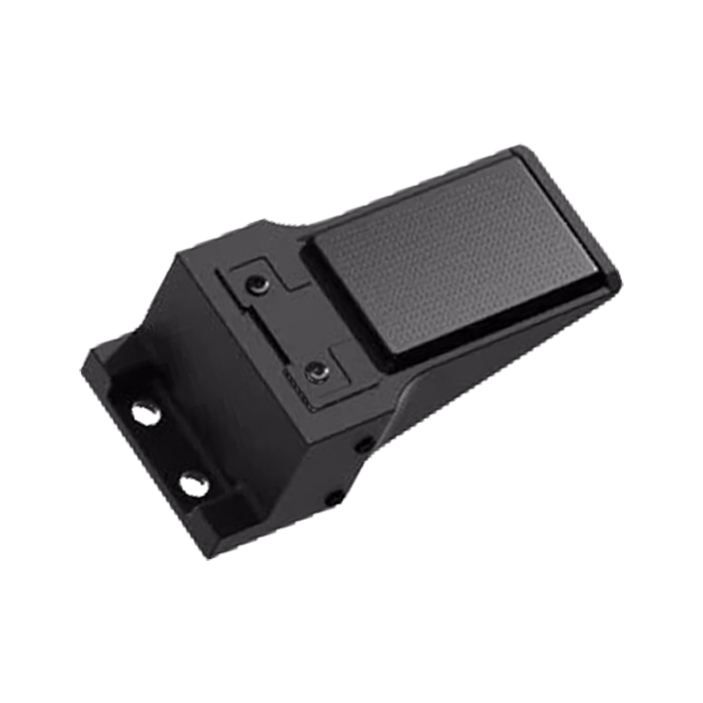
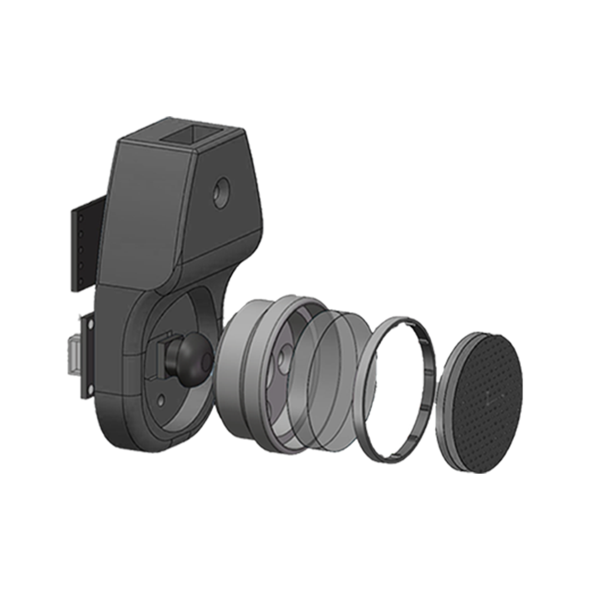

# Digital Mining Platform<span>&nbsp;&nbsp;&nbsp;&nbsp;&nbsp;&nbsp;</span><small>powered by</small><span>&nbsp;&nbsp;</span>


  




## 📋 Introduction
Lumos intelligent training system is a data collection, management, and annotation system designed for the embodied intelligent field. It aims to provide high-quality, scalable data services for VLA model training. The platform adopts a storage and business separation architecture, allowing data to be flexibly stored in public cloud object storage or private cloud object storage. In a local private cloud deployment environment, the platform has stably supported over 300TB of data annotation, import, and export, fully validating the high scalability and reliability of the architecture.

## 📖 Ability
* Multi-modal Data Acquisition Hardware & Software System FastUMI Pro
* Data Augmentation & Enhancement System AugKit
* Intelligent Annotation System Labelkit
* Data Quality Evaluation System Qualikit
* Multi-modal Evaluation MODEL BENCHMARK
* Model Training MODEL TRAINING

## 🚀 Deployment
### 1. git clone reposotory
```bash
git clone git@github.com:FastUMIData/FastUMI_Data_Platform_Web.git
```
### 2. download backend binary files
Due to github upload file size restrictions, please first download the file from the following link：
https://pan.baidu.com/s/1qrWr-NCGLDP3PmhrnBL8eg?pwd=s4ux

### 3. run deploy.bash
```bash
bash deploy.sh
```
