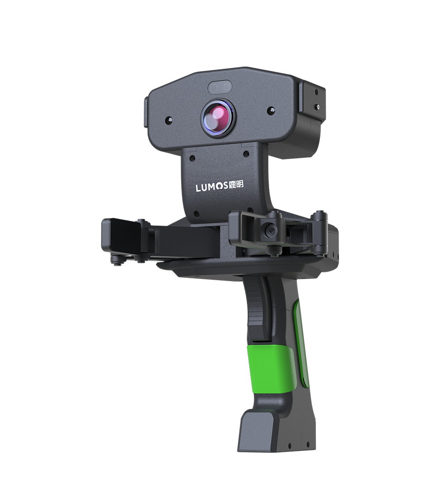
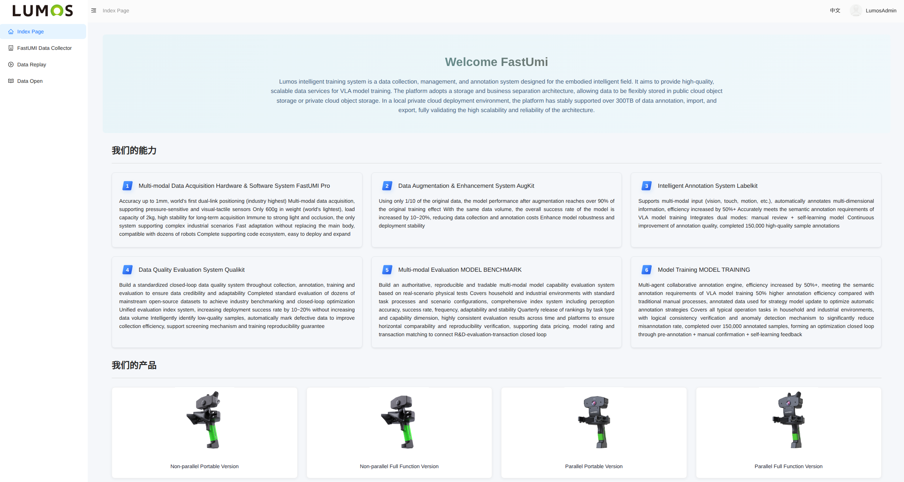
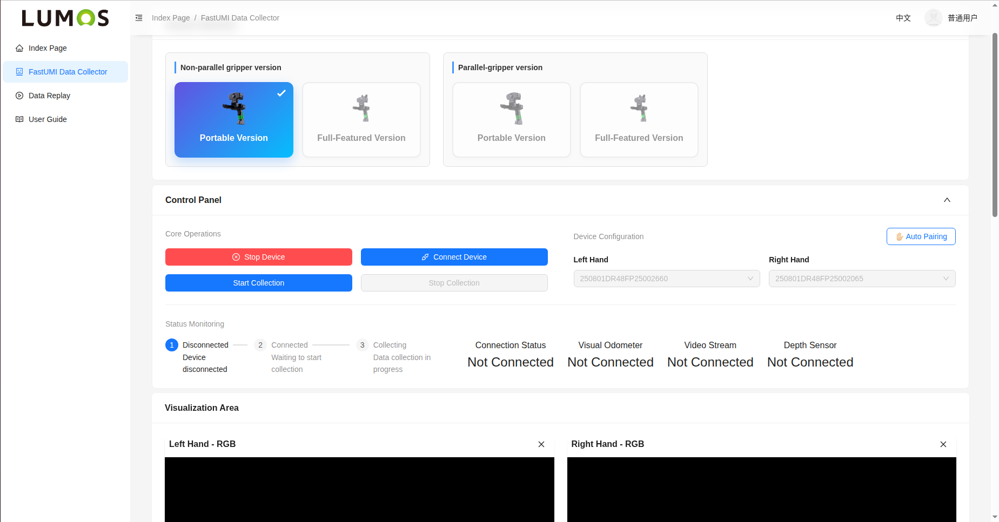
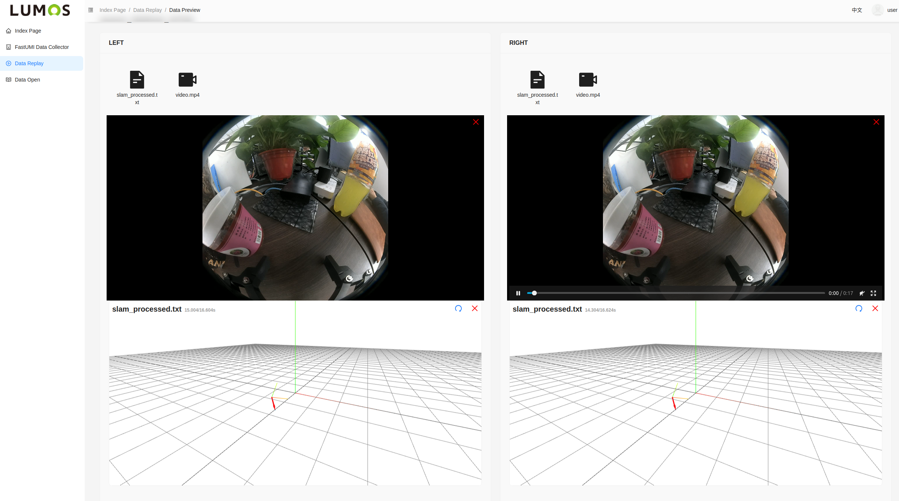
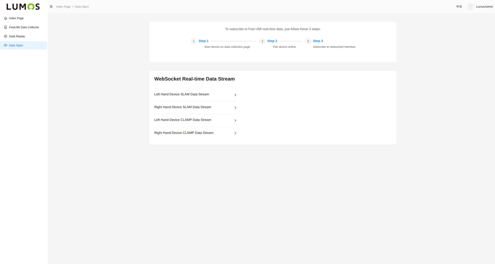

# FastUMI Pro Data Platform (Web)<span>&nbsp;&nbsp;&nbsp;&nbsp;&nbsp;&nbsp;</span><sup>powered by</sup><span>&nbsp;&nbsp;</span>

  

homepage  |  data_collect
:-------------------------:|:-------------------------:
  |  

<div style="width: 100%; overflow-x: auto; white-space: nowrap; padding: 10px 0; background: #f8f9fa;">

</div>


## 📋 Introduction
The FastUMI Pro Web Platform is a streamlined data collection and evaluation system for embodied AI. It enables seamless data capture from FastUMI Pro devices, including visual, tactile, and force data. The platform supports real-time playback for data review and validation, while built-in quality assessment tools ensure only high-quality data is retained for model training. It is designed to be user-friendly and suitable for both research and industrial applications.

## 🚀 Deployment
### 1. install hardware sdk
please refer to https://github.com/FastUMIData/FastUMI_Hardware_SDK,install ros1 and hardware sdk first.

### 2. git clone reposotory
```bash
git clone git@github.com:FastUMIData/FastUMI_Data_Platform_Web.git
```
### 3. download backend binary files
Due to github upload file size restrictions, please first download the file from the following link：
https://pan.baidu.com/s/1qrWr-NCGLDP3PmhrnBL8eg?pwd=s4ux

### 4. run deploy.bash
```bash
bash deploy.sh
```

## 📖 How to use
onced deployed,please visit http://localhost:8000 address in browser,use user/user123 to login.

## 🔗 Contact us
please visit our website:https://www.fastumi.com/pro
