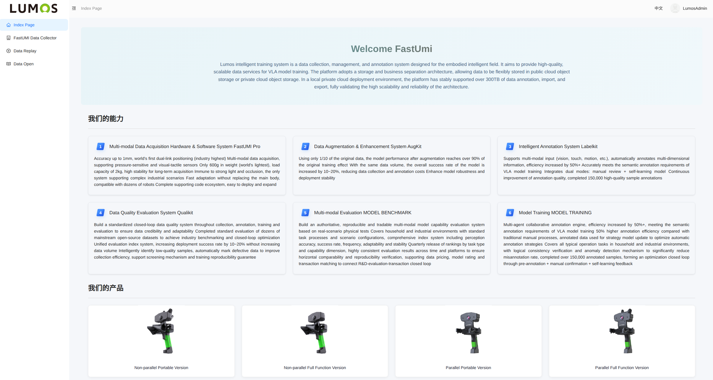
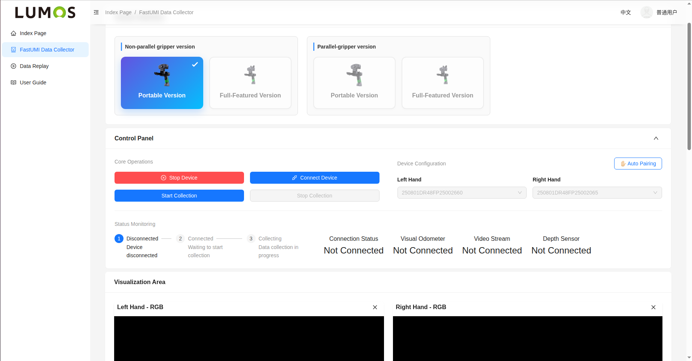
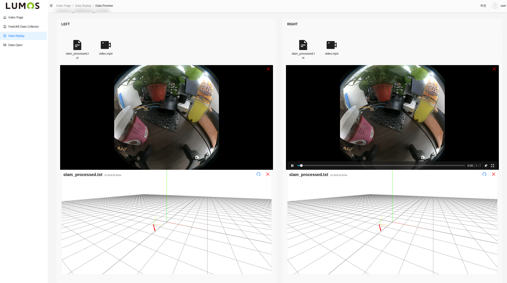
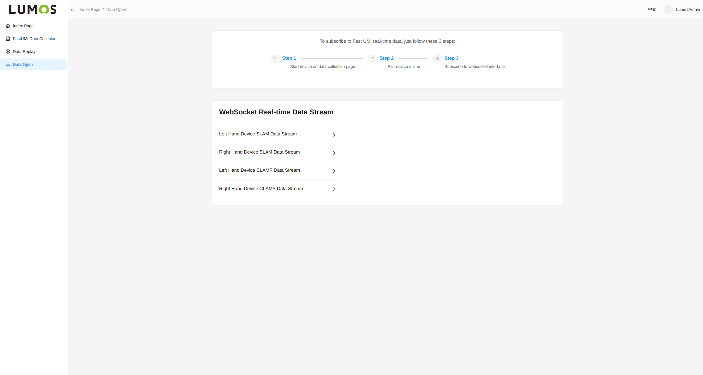

# FastUMI Pro Data Platform (Web)

homepage  |  data collection
:-------------------------:|:-------------------------:
  |  

data replay  |  data open
:-------------------------:|:-------------------------:
  |  


## 📋 Introduction
The FastUMI Pro Web Platform is a streamlined data collection and evaluation system for embodied AI. It enables seamless data capture from FastUMI Pro devices, including visual, tactile, and force data. The platform supports real-time playback for data review and validation, while built-in quality assessment tools ensure only high-quality data is retained for model training. It is designed to be user-friendly and suitable for both research and industrial applications.

## 🚀 Deployment
### 1. install hardware sdk
please refer to https://github.com/FastUMIData/FastUMI_Hardware_SDK, install ros1 and hardware sdk first.

### 2. git clone reposotory
```bash
git clone git@github.com:FastUMIData/FastUMI_Data_Platform_Web.git
```
### 3. download backend binary files
Considering the differences in users' computer hardware configurations, we currently provide three versions of the backend binary files. Please select the appropriate version based on your actual configuration. We have a list of recommended computer configurations available at: https://www.fastumi.com/pro/#recommendConfiguration.
Due to the file size limit for uploads on GitHub, please download the files from the links below first:
1. **Full-featured version**: including data visualization, data collection, data replay and data open.
https://pan.baidu.com/s/1LyOcmxvk7ed37NseV-vTuw?pwd=kc5n
2. **TOF data-free version**: including data visualization, data collection (excluding TOF data), data replay and data open
https://pan.baidu.com/s/1sPO4iVwrC0TsckAkDtbznQ?pwd=btmc
3. **Function-limited version**: including data collection (excluding TOF data), data replay and data open
https://pan.baidu.com/s/18GLra9Y3cjP0KpQVw1gnAA?pwd=eg23

### 4. run deploy.bash
```bash
bash deploy.sh
```

## 📖 How to use
onced deployed, please visit http://localhost:8000 address in browser, use user/user123 to login.

## 🔗 Contact us
please visit our website https://www.fastumi.com/pro
